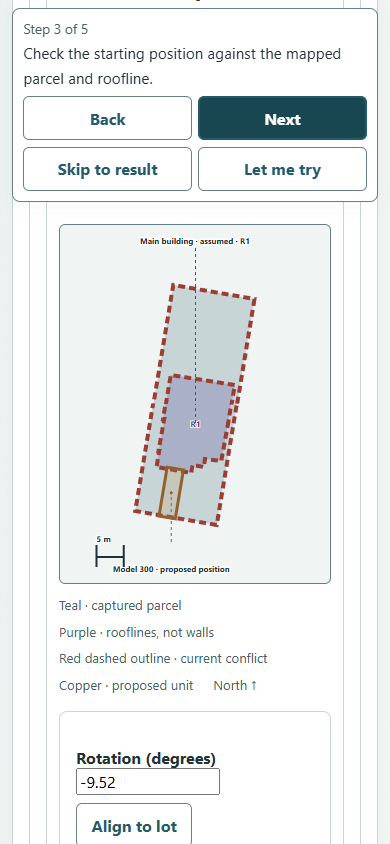
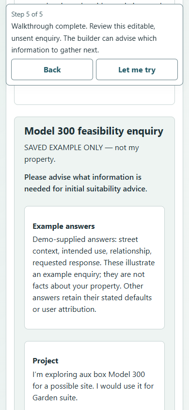

# Guided example walkthrough

Initially implemented on October 9, 2026; explicit Next/Back navigation replaces
timed playback against merged baseline `d7fe466c18914bc2d2cc65601b20340d8b09b1db`.
This is an editable preliminary demonstration, not accepted site evaluation.

Home offers Start assessment, Try an example and Watch a walkthrough. The latter
two share the existing example initializer, Model 300 and saved Victoria Parcel 87.
Opening or replaying an example protects an existing assessment with the existing
replacement dialog. Explicit replacement resets local example answers; ordinary
Start assessment and history navigation preserve the current journey.

Five narrated phases reuse the current journey: model, saved property, before/after
placement, current findings with example answers, and an editable unsent enquiry.
The initial and moved inputs were reproduced against the current bundled capture
and real local geometry API. The moved centre is `(473693.7, 5362202.36)` in
EPSG:3157; dimensions and orientation come from the existing example/catalogue.
The review supplied this movement for this parcel, not for arbitrary geometry.
No stored response or timer declares success. Placement/current revision readiness
gates Next; failures remain at the current workspace with retry/takeover.

One floating panel shows the current explanation, Step 1–5, Back and Next. There
are no dwell timers or Pause/Resume controls, including with normal motion. Back
restores the initial placement when revisiting the before/after comparison and
awaits its new measurement. Next waits for current checks. Skip applies the moved
input, awaits current checks, supplies related example answers together and stops
at the findings; Next then opens the unsent enquiry. All transitions use one
instant scroll after their target renders. Completion retains Back and Let me try. No playback action
copies, downloads, confirms readiness, opens a provider or sends a message.

Editing, model/property changes, navigation and unmount cancel pending playback.
Pointer-down invalidates pending skip advancement without shifting the layout under a click or drag;
the interaction completes before the caption area is removed. Existing request
version/abort checks reject old measurements. Playback owns scrolling and suppresses
both existing docking paths; manual docks now show a compact action. A queued resize
callback after unmount was reproduced in the browser and now checks its element.

Garden suite, unknown street context, example relationship and requested response
have `demo_supplied` attribution in technical evidence and a grouped readable note
in enquiries/reports. Individual edits remove that answer's demo attribution.
Changing models preserves attribution for an unchanged example intention; changing
properties clears that example intention so it cannot become a claimed user answer.
The garden-suite scenario origin survives the existing HTTP boundary/evaluator;
demo origins cannot assert zoning, title or other favourable legal facts. Existing
journey defaults and municipal observations keep their separate origins. Main-home
type stays unknown; no street roles, legal frontage, rear-yard pass or approval is
invented. Refresh retains only the existing historical export recovery, not editable
playback or placement state.

## Verification

Run from the repository root:

```powershell
npm ci --prefix frontend
npm test --prefix frontend
npm run typecheck --prefix frontend
npm run build --prefix frontend
python -m uv run --locked pytest -q tests/test_scouting_geometry.py tests/test_conditional_screening_api.py tests/test_conditional_screening.py
python -m uv run --locked ruff check app/conditional_screening tests/test_conditional_screening_api.py
```

For the repeatable real-browser suite, start the stateless API on `127.0.0.1:8019`
and Vite on `127.0.0.1:5199` in this checkout. No database or model credentials are
needed. The suite forwards local geometry/planning HTTP to that API and explicitly
fails external municipal lookup/scan boundaries. It rejects external requests and
unexpected downloads/popups during playback. On Windows with installed Chrome:

```powershell
$env:WALKTHROUGH_URL='http://127.0.0.1:5199'
$env:WALKTHROUGH_API='http://127.0.0.1:8019'
$env:WALKTHROUGH_BROWSER='chrome'
npm run test:walkthrough --prefix frontend
```

Alternatively install Playwright Chromium with `npx playwright install chromium`
in `frontend` and omit `WALKTHROUGH_BROWSER`. The suite only accepts loopback URLs.
Browser evidence is in [walkthrough-verification](walkthrough-verification/):
desktop/narrow screenshots, measured before/after checks, exact final evidence and
a representative explicitly saved enquiry. The PDF download occurs after Let me
try, never during playback. The CI integration regression uses a retained response
at the HTTP boundary and deliberately ignores abort to exercise obsolete response
rejection; it does not prove geometry arithmetic. The backend regression independently
checks demo-origin preservation and rejects demo-attributed legal assertions.

Final local results: 177 frontend tests passed; TypeScript/Vite build passed;
48 focused geometry/conditional tests passed; focused Ruff and `git diff --check`
passed. No database tests were run locally because no isolated PostgreSQL was
configured. Vite retains its existing large-chunk advisory; FastAPI testing reports
the existing httpx deprecation. The original timed version completed in 56.806
seconds; explicit navigation has no duration target.
Final-head GitHub CI is a separate integration check.

Observed browser run: Next/Back with restored initial geometry; disabled Next during an in-flight
measurement; incomplete geometry response; skip to findings and replay with keep/replace; failure and retry; model switch
with a late response; property correction/manual fallback; 390 × 844 keyboard
takeover and reduced motion; navigation exit; a normal-motion hold longer than the former dwell without advancement; unsent output
and exact source evidence. The geometry reproduced about 0.7 m² outside and 1.6 m²
roof overlap initially, then containment/no observed overlap with about 2.08 m to
the mapped boundary and 5.08 m to the roofline. These are reproduction observations,
not copied numerical oracles or legal setbacks. See `browser-results.json` for the
actual navigation checks and unrounded measurements.

PDF recipient inspection used Poppler page rendering: the main enquiry carries
the request, example identity, synthetic-answer attribution, product questions and
separate planning uncertainty. Its existing placement page crowds lower source text against the page edge and footer;
the exact evidence/links remain in the JSON and readable output. This is retained
QA evidence, not a claim that the export's pagination is accepted.

## Remaining work and integration ownership

- **Repeated questions:** defer grouping shared street-context and unsupported-use
  questions to a separate results presentation change. Impact: the current summary
  still repeats some review work. Next task: results owner groups genuinely shared
  questions with constituent evidence expandable, retaining distinct conflicts,
  technical counts and evaluator semantics. Coordinate with open results PR #296.
- **PDF plan pagination:** the representative save crowds lower source text against the
  placement page edge and footer. Impact: PDF source reading is unreliable. Next action:
  export owner reproduces with the retained example PDF and fixes/re-renders plan
  pagination and footer separation in the active export work (#298) before relying on this save for sharing.
  Plain text and exact JSON remain available; this is not a walkthrough blocker.
- **Overlapping work:** #296–#298 were open at the starting base; the journey and
  export/results surfaces overlap. No parallel feature ownership or cherry-picking
  was introduced. Integration owner reconciles these PRs and reruns combined checks.
- **External/source readiness:** municipal success/network variability and live
  site acceptance were not established by the offline browser boundaries. Controlled
  drawings, legal/site facts and independently reviewed sources remain missing.
  Impact: geometric exploration is usable, accepted real evaluation is still blocked.
  Next action: source/data owner acquires inputs, reviews applicability and publishes
  accepted data separately. No publication, deployment or merge occurred here.
- **Human validation/accessibility breadth:** keyboard/reduced-motion/narrow Chrome
  checks are software evidence, not a full assistive-technology/touch/cross-browser
  audit or homeowner/builder study. Quinn/product researcher owns the bounded
  participant sessions from the review; QA expands interaction/browser coverage.

The retained October 9 homeowner review and its initial/moved evidence were read
from the primary checkout's `docs/research/homeowner-flow-2026-10-09-review-01/`
(review chat `01a121fb-f506-7612-99a9-9aab188fc4b5`). Those unrelated local reports
were not copied into this PR. Software correctness, source review, accepted data
publication and human validation remain separate evidence categories.

## Representative narrow views




